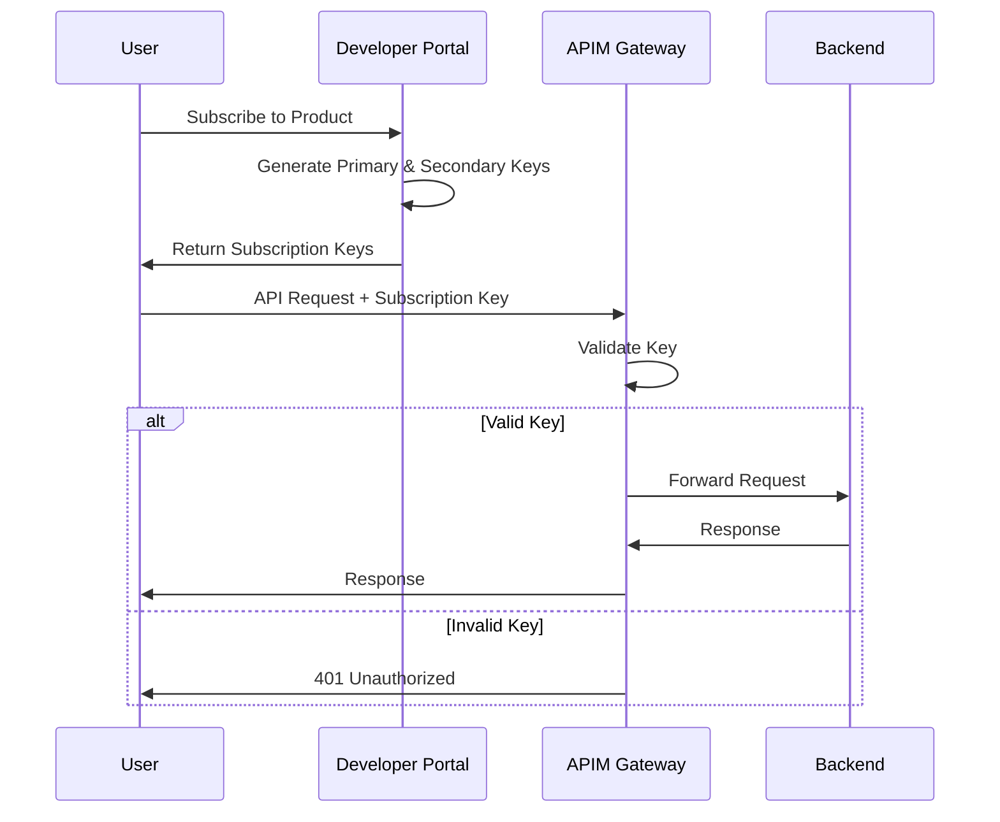
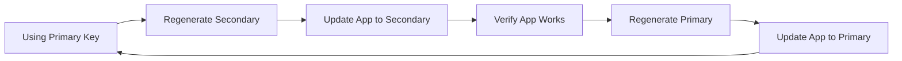

# API Keys in Azure APIM

API keys (Subscription keys) are the simplest form of authentication in Azure API Management.

## What are API Keys?

API keys in APIM are automatically generated keys associated with:
- **Products** - Access to all APIs in a product
- **APIs** - Access to a specific API
- **All APIs** - Master subscription (not recommended for production)

## How They Work



## Types of Subscriptions

### 1. Product Subscription (Recommended)

Most common - grants access to all APIs in a product:

```bash
# Subscribe via Developer Portal or programmatically
# Key scoped to product: "starter", "premium", etc.
```

### 2. API-Specific Subscription

Access to a single API:

```bicep
resource subscription 'Microsoft.ApiManagement/service/subscriptions@2023-05-01-preview' = {
  name: 'api-specific-subscription'
  properties: {
    displayName: 'Weather API Subscription'
    scope: '/apis/weather-api'
    state: 'active'
  }
}
```

### 3. All-APIs Subscription

Master key - not recommended for production:

```
Scope: /
Access: All APIs
Use: Testing, administration only
```

## Creating Subscriptions

### Via Developer Portal

1. Sign in to Developer Portal
2. Navigate to **Products**
3. Select a product
4. Click **Subscribe**
5. Enter subscription name
6. Submit (may require approval)
7. View keys in **Profile → Subscriptions**

### Via Azure Portal

1. Navigate to APIM instance
2. Go to **Subscriptions**
3. Click **+ Add subscription**
4. Configure:
   - **Name**: Internal identifier
   - **Display name**: User-friendly name
   - **Scope**: Product or API
   - **User**: Optional user assignment
5. Click **Create**
6. Copy primary and secondary keys

### Via Bicep

```bicep
module subscription '../bicep/modules/subscription.bicep' = {
  name: 'user-subscription'
  params: {
    apimServiceName: 'your-apim-name'
    subscriptionName: 'user-app-subscription'
    displayName: 'User App Subscription'
    scope: '/products/premium'
    state: 'active'
  }
}
```

### Via Azure CLI

```bash
az apim subscription create \
  --resource-group rg-apim-learning \
  --service-name your-apim-name \
  --subscription-id user-subscription \
  --display-name "User Subscription" \
  --scope /products/starter \
  --state active
```

## Using Subscription Keys

### Method 1: Header (Recommended)

Default header:
```http
GET https://your-apim.azure-api.net/api/products
Ocp-Apim-Subscription-Key: your-subscription-key-here
```

Custom header (configure in product settings):
```http
GET https://your-apim.azure-api.net/api/products
X-API-Key: your-subscription-key-here
```

### Method 2: Query Parameter

```http
GET https://your-apim.azure-api.net/api/products?subscription-key=your-key
```

**Note:** Query parameters appear in logs - less secure than headers.

### Method 3: Configuration in Code

#### JavaScript/TypeScript
```typescript
const apiKey = 'your-subscription-key';

fetch('https://your-apim.azure-api.net/api/products', {
  headers: {
    'Ocp-Apim-Subscription-Key': apiKey
  }
})
.then(response => response.json())
.then(data => console.log(data));
```

#### C#
```csharp
using var client = new HttpClient();
client.DefaultRequestHeaders.Add("Ocp-Apim-Subscription-Key", "your-subscription-key");

var response = await client.GetAsync("https://your-apim.azure-api.net/api/products");
var content = await response.Content.ReadAsStringAsync();
```

#### Python
```python
import requests

headers = {
    'Ocp-Apim-Subscription-Key': 'your-subscription-key'
}

response = requests.get(
    'https://your-apim.azure-api.net/api/products',
    headers=headers
)
data = response.json()
```

#### cURL
```bash
curl -X GET "https://your-apim.azure-api.net/api/products" \
  -H "Ocp-Apim-Subscription-Key: your-subscription-key"
```

## Primary and Secondary Keys

Each subscription has two keys:

### Primary Key
- Main key for production use
- Use this in your application

### Secondary Key
- Backup key
- Used during key rotation

## Key Rotation Strategy

Zero-downtime key rotation:



### Steps

1. **Currently using**: Primary key in production
2. **Regenerate**: Secondary key
3. **Update**: Application to use secondary key
4. **Test**: Verify everything works
5. **Regenerate**: Primary key (old primary is now invalid)
6. **Optional**: Update back to primary key

### Regenerate Keys

#### Via Azure Portal
1. Go to **Subscriptions**
2. Select subscription
3. Click **Regenerate primary** or **Regenerate secondary**

#### Via Azure CLI
```bash
# Regenerate primary key
az apim subscription regenerate-primary-key \
  --resource-group rg-apim-learning \
  --service-name your-apim-name \
  --subscription-id user-subscription

# Regenerate secondary key
az apim subscription regenerate-secondary-key \
  --resource-group rg-apim-learning \
  --service-name your-apim-name \
  --subscription-id user-subscription
```

## Managing Subscriptions

### Subscription States

- **Active**: Normal operation
- **Suspended**: Temporarily disabled
- **Submitted**: Awaiting approval
- **Rejected**: Approval denied
- **Cancelled**: User cancelled
- **Expired**: Past expiration date

### Suspend a Subscription

```bash
az apim subscription update \
  --resource-group rg-apim-learning \
  --service-name your-apim-name \
  --subscription-id user-subscription \
  --state suspended
```

### Delete a Subscription

```bash
az apim subscription delete \
  --resource-group rg-apim-learning \
  --service-name your-apim-name \
  --subscription-id user-subscription
```

## Subscription Settings

### Configure Header Name

Change default header name in product settings:

```bicep
resource product 'Microsoft.ApiManagement/service/products@2023-05-01-preview' = {
  properties: {
    subscriptionKeyParameterNames: {
      header: 'X-API-Key'
      query: 'apiKey'
    }
  }
}
```

### Require Approval

```bicep
resource product 'Microsoft.ApiManagement/service/products@2023-05-01-preview' = {
  properties: {
    approvalRequired: true
  }
}
```

## Security Best Practices

### 1. Store Keys Securely

❌ **Never do this:**
```javascript
// Hardcoded in client-side code
const apiKey = 'abc123...';
```

✅ **Do this instead:**
```javascript
// Use environment variables
const apiKey = process.env.APIM_API_KEY;

// Or secure backend proxy
fetch('/api/proxy/products'); // Your backend adds the key
```

### 2. Use HTTPS Only

```xml
<policies>
    <inbound>
        <choose>
            <when condition="@(context.Request.Url.Scheme != "https")">
                <return-response>
                    <set-status code="403" />
                    <set-body>HTTPS required</set-body>
                </return-response>
            </when>
        </choose>
    </inbound>
</policies>
```

### 3. Implement Rate Limiting

```xml
<policies>
    <inbound>
        <rate-limit calls="10" renewal-period="60" />
        <quota calls="1000" renewal-period="86400" />
    </inbound>
</policies>
```

### 4. Monitor for Suspicious Activity

- Watch for unusual usage patterns
- Alert on failed authentication attempts
- Track API usage per subscription

### 5. Rotate Keys Regularly

- Rotate every 90 days
- Rotate immediately if compromised
- Use secondary key for zero-downtime rotation

### 6. Limit Subscription Scope

- Use product-specific subscriptions
- Avoid all-APIs subscriptions in production
- Follow principle of least privilege

## Validating Subscription Keys in Policy

Custom validation logic:

```xml
<policies>
    <inbound>
        <!-- Get subscription key from custom header -->
        <set-variable name="apiKey"
                     value="@(context.Request.Headers.GetValueOrDefault("X-Custom-Key", ""))" />

        <!-- Validate key format -->
        <choose>
            <when condition="@(string.IsNullOrEmpty((string)context.Variables["apiKey"]))">
                <return-response>
                    <set-status code="401" />
                    <set-body>{"error": "API key required"}</set-body>
                </return-response>
            </when>
        </choose>

        <!-- Set standard subscription key header -->
        <set-header name="Ocp-Apim-Subscription-Key" exists-action="override">
            <value>@((string)context.Variables["apiKey"])</value>
        </set-header>
    </inbound>
</policies>
```

## Troubleshooting

### 401 Unauthorized

Common causes:
- Missing subscription key
- Invalid/expired key
- Wrong header name
- Key not associated with product/API

### 403 Forbidden

Common causes:
- Subscription suspended
- Product/API not accessible
- IP filtering policy blocking request
- Rate limit exceeded

### Testing Subscriptions

```http
### Test with valid key
GET https://your-apim.azure-api.net/api/products
Ocp-Apim-Subscription-Key: {{validKey}}

### Test with invalid key
GET https://your-apim.azure-api.net/api/products
Ocp-Apim-Subscription-Key: invalid-key

### Test without key
GET https://your-apim.azure-api.net/api/products
```

## Next Steps

- [Subscription Keys Details](subscription-keys.md)
- [OAuth 2.0 Authentication](oauth2.md)
- [Products Guide](../products/what-are-products.md)
- [Testing APIs](../../tests/README.md)

## Resources

- [APIM Subscriptions](https://learn.microsoft.com/azure/api-management/api-management-subscriptions)
- [Subscription Keys](https://learn.microsoft.com/azure/api-management/api-management-howto-create-subscriptions)
