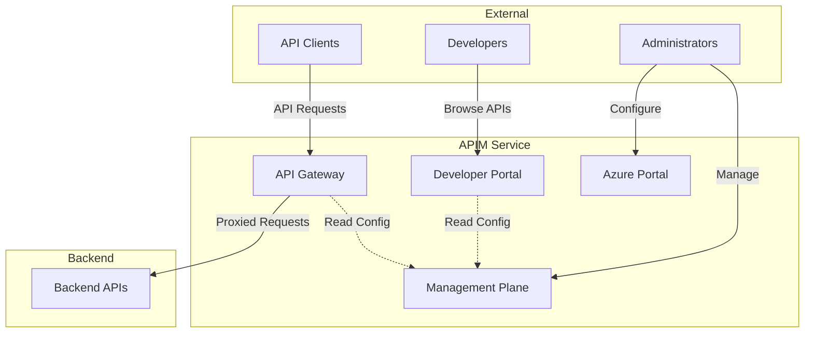
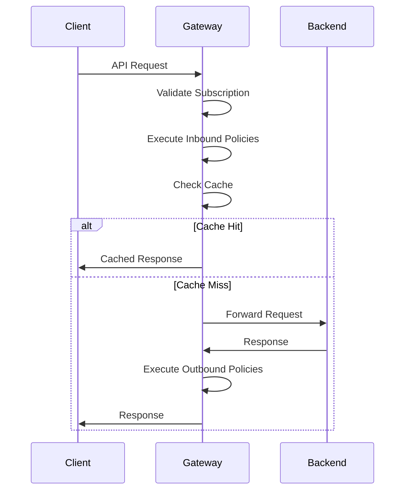
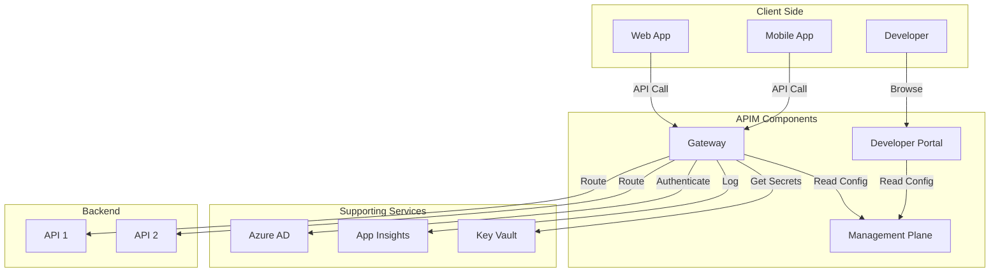
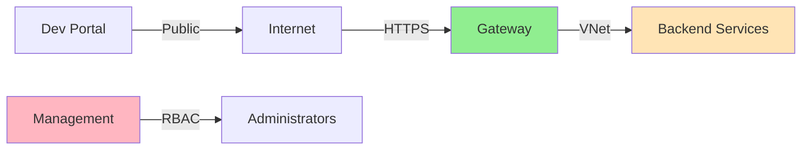

# APIM Components

Azure API Management consists of several key components that work together to provide a complete API management solution.

## Component Overview



## 1. API Gateway

The Gateway is the **runtime component** that handles all API traffic.

### Responsibilities

- **Request Routing**: Forwards requests to appropriate backend services
- **Policy Execution**: Applies policies (security, transformation, caching)
- **Authentication**: Validates API keys, tokens, certificates
- **Rate Limiting**: Enforces quotas and throttling
- **Caching**: Stores and serves cached responses
- **Logging**: Records request/response data
- **Protocol Translation**: Converts between protocols (HTTP, SOAP, WebSocket)

### Gateway Endpoints

```
https://{apim-name}.azure-api.net
```

Or with custom domains:
```
https://api.yourdomain.com
```

### Request Flow Through Gateway



### Gateway Types

1. **Managed Gateway**: Hosted by Microsoft in Azure
2. **Self-hosted Gateway**: Deployed in your own environment (Docker/Kubernetes)
3. **Gateway in VNet**: Integrated with Azure Virtual Network

## 2. Developer Portal

The Developer Portal is a **self-service website** for API consumers.

### Features

- **API Discovery**: Browse available APIs and operations
- **Documentation**: Automatically generated from OpenAPI specs
- **Interactive Console**: Test APIs directly in the browser
- **Subscription Management**: Request and manage API subscriptions
- **API Keys**: View and regenerate subscription keys
- **Code Samples**: Auto-generated code snippets
- **User Accounts**: Self-service registration
- **Community**: Comments, ratings, forums

### Developer Portal URL

```
https://{apim-name}.developer.azure-api.net
```

### Customization

- Fully customizable HTML/CSS
- Custom branding and styling
- Custom pages and content
- Managed through Azure Portal or Git

### Developer Workflow


## 3. Management Plane

The Management Plane provides **configuration and control**.

### Capabilities

- API definitions and operations
- Product configuration
- Policy management
- User and subscription management
- Analytics and reporting
- System configuration

### Access Methods

1. **Azure Portal**: Web-based UI
2. **Management REST API**: Programmatic access
3. **Azure CLI**: Command-line interface
4. **PowerShell**: Automation scripts
5. **Bicep/ARM**: Infrastructure as Code

### Management API URL

```
https://{apim-name}.management.azure-api.net
```

## 4. Azure Portal Integration

The Azure Portal provides the **administrative interface**.

### What You Can Do

- Create and configure APIM instances
- Import and manage APIs
- Create products and subscriptions
- Configure policies
- Monitor analytics
- Manage users and groups
- Configure custom domains
- Set up virtual networks

## Supporting Components

### Application Insights

- Performance monitoring
- Request tracking
- Exception logging
- Custom telemetry
- Alerts and dashboards

### Azure Key Vault

- Secure storage of secrets
- Certificate management
- Named value integration
- Managed identity access

### Azure Active Directory

- User authentication
- OAuth 2.0 provider
- JWT token validation
- Role-based access control (RBAC)

### Log Analytics

- Centralized logging
- Query language (KQL)
- Long-term log retention
- Custom reports

## Component Interaction



## Gateway Deployment Options

### Cloud Gateway (Default)

- Fully managed by Microsoft
- Auto-scaling
- Multiple regions (Premium tier)
- Integrated with Azure services

### Self-Hosted Gateway

Deploy the gateway as a container in:
- On-premises data centers
- Other cloud providers
- Edge locations
- Kubernetes clusters

**Use Cases:**
- Hybrid cloud scenarios
- Edge computing
- Regulatory requirements
- Low-latency needs

**Deployment:**
```bash
docker run -d -p 80:8080 -p 443:8081 \
  --name apim-gateway \
  -e config.service.endpoint='{gateway-endpoint}' \
  -e config.service.auth='{gateway-key}' \
  mcr.microsoft.com/azure-api-management/gateway:latest
```

## High Availability

### Built-in HA

- Multi-region deployment (Premium tier)
- Auto-scaling based on load
- Built-in redundancy
- 99.99% SLA (Premium)

### Disaster Recovery

- Active-active multi-region
- Automated failover
- Geo-replication of configuration
- Backup and restore

## Performance Characteristics

| Component | Typical Latency | Throughput |
|-----------|----------------|------------|
| Gateway | < 10ms overhead | Up to 10k req/sec per unit |
| Developer Portal | Standard web app | N/A |
| Management API | 100-500ms | Moderate |

## Security Boundaries



## Monitoring Each Component

### Gateway Monitoring

- Request count and latency
- Error rates
- Cache hit ratio
- Subscription usage
- Geographic distribution

### Developer Portal Monitoring

- Page views
- User registrations
- API subscription requests
- Try-it usage

### Management Plane Monitoring

- Configuration changes
- API deployments
- Policy updates
- Admin activities

## Best Practices

1. **Enable Application Insights** on all environments
2. **Use Managed Identity** for backend authentication
3. **Deploy self-hosted gateways** for hybrid scenarios
4. **Customize Developer Portal** for better user experience
5. **Monitor gateway performance** continuously
6. **Use multiple regions** for high availability (Premium tier)
7. **Implement caching** to reduce backend load
8. **Enable API analytics** for insights

## Next Steps

- [Understand Service Tiers](service-tiers.md)
- [Learn about APIs](apis.md)
- [Explore Architecture](../../diagrams/architecture.mmd)
- [Deploy APIM](../../bicep/README.md)
