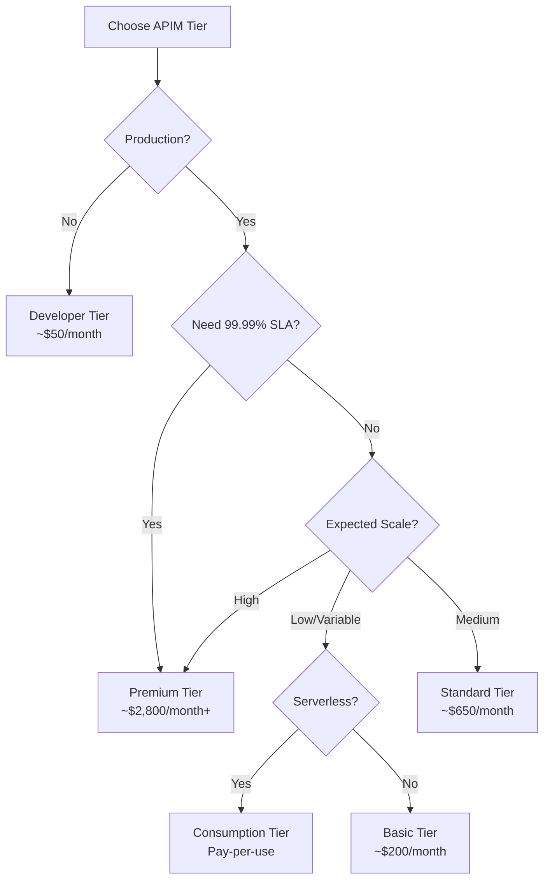

# APIM Service Tiers

Azure API Management offers different service tiers to match various needs and budgets. Choosing the right tier is crucial for balancing features, performance, and cost.

## Tier Comparison Overview

| Feature | Consumption | Developer | Basic | Standard | Premium |
|---------|------------|-----------|-------|----------|---------|
| **SLA** | 99.95% | None | 99.95% | 99.95% | 99.99% |
| **Pricing Model** | Pay-per-execution | Fixed monthly | Fixed monthly | Fixed monthly | Fixed monthly |
| **Usage** | Serverless | Dev/Test | Small production | Production | Enterprise |
| **Scale Units** | Auto | 1 | 2 | 4 | 10+ |
| **Max Requests/sec** | Auto-scales | Limited | ~1,000 | ~2,500 | ~4,000 per unit |
| **Storage** | None | 10 GB | 10 GB | 50 GB | 50 GB |
| **Virtual Network** | ❌ | ❌ | ❌ | ❌ | ✅ |
| **Multi-region** | ❌ | ❌ | ❌ | ❌ | ✅ |
| **Custom domains** | ❌ | ✅ | ✅ | ✅ | ✅ |
| **Developer Portal** | ❌ | ✅ | ✅ | ✅ | ✅ |
| **Self-hosted gateway** | ❌ | ❌ | ❌ | ❌ | ✅ |
| **Availability Zones** | ❌ | ❌ | ❌ | ❌ | ✅ |
| **Monthly Cost** | Variable | ~$50 | ~$200 | ~$650 | ~$2,800 |

## 1. Consumption Tier

**Best for:** Serverless, event-driven, or highly variable workloads

### Characteristics

- **Pricing**: Pay only for executions (per 1 million calls)
- **Auto-scaling**: Automatic, instant scaling
- **Cold start**: May have initial latency
- **No Developer Portal**: Limited to API calls only

### Pricing Example

```
First 1M calls/month: Free
Additional calls: $3.50 per million
```

### When to Use

✅ Event-driven architectures
✅ Unpredictable or spiky traffic
✅ Low-budget testing
✅ Infrequent API calls

### Limitations

❌ No developer portal
❌ No custom domains
❌ Limited policy support
❌ No VNet integration
❌ Higher per-call latency potential

### Example Use Case

```
Scenario: IoT data ingestion
- 10M requests/month
- Highly variable traffic
- Cost: ~$35/month

vs. Developer tier: $50/month (fixed)
```

## 2. Developer Tier

**Best for:** Development, testing, and non-production workloads

### Characteristics

- **No SLA**: Not for production
- **Single region**: No multi-region support
- **Full features**: Access to all APIM features
- **Fixed cost**: Predictable pricing

### Pricing

```
~$50/month (region dependent)
No per-call charges
```

### When to Use

✅ Development and testing
✅ Learning and experimentation
✅ POC and demos
✅ CI/CD pipelines

### Limitations

❌ **No SLA** - Not production-ready
❌ Single unit (limited scale)
❌ No high availability
❌ No scaling options

### Deployment Example

```bicep
resource apim 'Microsoft.ApiManagement/service@2023-05-01-preview' = {
  name: 'apim-dev-instance'
  sku: {
    name: 'Developer'
    capacity: 1
  }
  properties: {
    publisherEmail: 'dev@example.com'
    publisherName: 'Dev Team'
  }
}
```

## 3. Basic Tier

**Best for:** Small production workloads with basic requirements

### Characteristics

- **99.95% SLA**: Production-ready
- **Up to 2 units**: Limited scaling
- **Single region**: No geographic redundancy
- **Lower cost**: Entry-level production tier

### Pricing

```
~$200/month per unit
Max 2 units = ~$400/month max
```

### When to Use

✅ Small production APIs
✅ Internal APIs with moderate traffic
✅ Budget-conscious production workloads
✅ Non-critical applications

### Capacity

- **Max units**: 2
- **Throughput**: ~2,000 req/sec total
- **Storage**: 10 GB

### Example Use Case

```
Scenario: Internal employee API
- 5M requests/month
- Predictable traffic
- Internal users only
- Cost: $200/month
```

## 4. Standard Tier

**Best for:** Production workloads with moderate scale

### Characteristics

- **99.95% SLA**: Production-ready
- **Up to 4 units**: Better scaling
- **Single region**: No multi-region
- **Enhanced capacity**: Higher throughput

### Pricing

```
~$650/month per unit
Max 4 units = ~$2,600/month max
```

### When to Use

✅ Medium-scale production
✅ Business-critical APIs
✅ Partner integrations
✅ Public-facing APIs

### Capacity

- **Max units**: 4
- **Throughput**: ~10,000 req/sec total
- **Storage**: 50 GB

### Scaling Example

```bicep
resource apim 'Microsoft.ApiManagement/service@2023-05-01-preview' = {
  name: 'apim-standard-instance'
  sku: {
    name: 'Standard'
    capacity: 2  // 2 units
  }
}
```

## 5. Premium Tier

**Best for:** Enterprise production workloads with advanced requirements

### Characteristics

- **99.99% SLA**: Highest availability
- **Multi-region**: Global distribution
- **VNet integration**: Private networking
- **Self-hosted gateway**: Hybrid deployments
- **Availability zones**: Enhanced resilience

### Pricing

```
~$2,800/month per unit per region
Multi-region adds cost per region
```

### When to Use

✅ Mission-critical APIs
✅ Global customer base
✅ Regulatory requirements
✅ Hybrid cloud scenarios
✅ High availability needs
✅ Enterprise security requirements

### Premium Features

#### Multi-Region Deployment

Deploy gateways in multiple Azure regions:

```
Primary: East US (2 units)
Secondary: West Europe (1 unit)
Failover: Southeast Asia (1 unit)

Total: 4 units across 3 regions
Cost: ~$11,200/month
```

#### VNet Integration

```bicep
resource apim 'Microsoft.ApiManagement/service@2023-05-01-preview' = {
  name: 'apim-premium-instance'
  sku: {
    name: 'Premium'
    capacity: 1
  }
  properties: {
    virtualNetworkType: 'Internal'
    virtualNetworkConfiguration: {
      subnetResourceId: vnetSubnet.id
    }
  }
}
```

#### Self-Hosted Gateway

Deploy gateways on-premises or in other clouds:

```bash
# Deploy to Kubernetes
kubectl apply -f apim-gateway-deployment.yaml

# Deploy to Docker
docker run -d mcr.microsoft.com/azure-api-management/gateway:latest
```

## Tier Selection Decision Tree



## Feature Comparison

### Networking

| Feature | Basic | Standard | Premium |
|---------|-------|----------|---------|
| Public endpoint | ✅ | ✅ | ✅ |
| Custom domains | ✅ | ✅ | ✅ |
| VNet integration | ❌ | ❌ | ✅ |
| Private endpoints | ❌ | ❌ | ✅ |
| Internal VNet mode | ❌ | ❌ | ✅ |

### High Availability

| Feature | Basic | Standard | Premium |
|---------|-------|----------|---------|
| Single region HA | ✅ | ✅ | ✅ |
| Multi-region | ❌ | ❌ | ✅ |
| Availability zones | ❌ | ❌ | ✅ |
| Auto-failover | ❌ | ❌ | ✅ |

### Advanced Features

| Feature | Basic | Standard | Premium |
|---------|-------|----------|---------|
| Developer portal | ✅ | ✅ | ✅ |
| Self-hosted gateway | ❌ | ❌ | ✅ |
| Built-in cache | ✅ | ✅ | ✅ |
| External cache (Redis) | ❌ | ❌ | ✅ |
| Client certificates | ✅ | ✅ | ✅ |

## Cost Optimization Tips

### 1. Start with Developer Tier

For learning and development, always use Developer tier:

```bash
# Development
sku: Developer
cost: $50/month

# Don't use Standard for dev
# Would cost: $650/month
# Waste: $600/month
```

### 2. Right-Size Production

Don't over-provision:

```
Scenario: 100 req/min average
Peak: 500 req/min

Basic tier (2 units): Sufficient
Standard tier: Overkill
Savings: $450/month
```

### 3. Use Consumption for Spiky Workloads

```
Traffic pattern:
- 0-10 requests/min: 95% of time
- 1000 requests/min: 5% of time

Consumption: ~$10/month
Basic: $200/month (underutilized)
```

### 4. Multi-Region Only When Needed

```
Single region Premium: $2,800/month
Three region Premium: $8,400/month

Only use multi-region if:
- Global user base
- < 100ms latency required
- Compliance requirements
```

## Migration Between Tiers

### Supported Migrations

```
Developer → Basic → Standard → Premium
```

### Migration Process

```bash
# Scale up
az apim update \
  --name myapim \
  --resource-group rg-apim \
  --sku-name Standard

# Scale down (within same tier)
az apim update \
  --name myapim \
  --resource-group rg-apim \
  --sku-capacity 2
```

### Migration Considerations

- Causes brief downtime (1-2 minutes)
- Configuration preserved
- No data loss
- Plan during maintenance window

## Monitoring and Scaling

### Metrics to Monitor

```
CPU Usage > 80%: Consider scaling up
Memory Usage > 75%: Consider scaling up
Request Rate approaching limit: Add units
Error Rate > 1%: Investigate
Latency > 1s: Check backend performance
```

### Auto-Scaling

Only available in Consumption tier. Other tiers require manual scaling:

```bicep
// Manual scaling
resource apim 'Microsoft.ApiManagement/service@2023-05-01-preview' = {
  sku: {
    name: 'Standard'
    capacity: 3  // Manually set units
  }
}
```

## Recommendations

### For Learning
👉 **Developer Tier** - Full features, low cost

### For Startups
👉 **Consumption or Basic** - Low initial cost, scale as needed

### For Small Business
👉 **Basic or Standard** - Reliable, affordable

### For Enterprise
👉 **Premium** - Advanced features, high availability

## Next Steps

- [Understand Components](components.md)
- [Deploy with Bicep](../../bicep/README.md)
- [Explore Pricing Calculator](https://azure.microsoft.com/pricing/calculator/)
