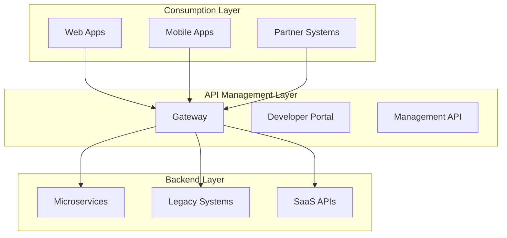

# What is Azure API Management?

Azure API Management (APIM) is a hybrid, multi-cloud management platform for APIs across all environments. It acts as a facade/gateway that sits between API consumers and your backend services.

## The Problem APIM Solves

Without APIM, you typically face these challenges:

- **Security**: Each backend service needs its own authentication/authorization
- **Monitoring**: No centralized way to track API usage and performance
- **Documentation**: Scattered or outdated API documentation
- **Rate Limiting**: Each service implements its own throttling
- **Versioning**: Complex version management across services
- **CORS**: Managing cross-origin requests per service
- **Caching**: Duplicate caching logic in multiple services

## The APIM Solution

APIM provides a unified solution:

```
[Clients] → [APIM Gateway] → [Backend Services]
              ↓
        [Policies Applied]
              ↓
        [Monitoring & Analytics]
```

## Core Value Propositions

### 1. API Gateway
- Single entry point for all API calls
- Routes requests to appropriate backends
- Protocol translation (REST to SOAP, etc.)
- Request/response transformation

### 2. Security
- Centralized authentication and authorization
- API keys and subscription management
- OAuth 2.0, JWT validation
- Client certificate authentication
- IP filtering and rate limiting

### 3. Developer Portal
- Self-service API discovery
- Interactive API documentation
- Try-it functionality
- Subscription key management
- Code samples in multiple languages

### 4. Policies
- Transform requests and responses
- Cache responses
- Validate JWT tokens
- Set rate limits and quotas
- Rewrite URLs
- Add/remove headers

### 5. Analytics & Monitoring
- Real-time analytics
- Application Insights integration
- Custom dashboards
- Usage reports
- Performance metrics

## When to Use APIM

APIM is ideal when you:

- Expose APIs to external partners or customers
- Have multiple microservices to manage
- Need centralized API governance
- Require detailed API analytics
- Want to monetize APIs through products
- Need to enforce security policies consistently
- Have legacy systems requiring modernization
- Support multiple API versions

## When NOT to Use APIM

Consider alternatives if:

- You have a single, simple API with no governance needs
- Your API is purely internal with no external access
- Cost is a major concern for low-traffic scenarios
- You need ultra-low latency (though APIM latency is typically < 10ms)
- Your requirements are simpler than what APIM offers

## Key Features

### API Management
- Import APIs from OpenAPI, WADL, WSDL
- Manual API definition
- Mock responses
- Versioning and revisions
- API deprecation

### Products & Subscriptions
- Group APIs into products
- Different tiers (Free, Basic, Premium)
- Subscription-based access control
- Self-service subscription requests

### Policies
- Inbound, outbound, backend, on-error scopes
- Global, product, API, and operation levels
- 50+ built-in policies
- Custom policy support with C# expressions

### Developer Experience
- Customizable developer portal
- Interactive API console
- Code generation
- API documentation
- Community features (comments, ratings)

### Integration
- Azure Active Directory
- Azure Monitor and Application Insights
- Azure Key Vault
- Azure Functions and Logic Apps
- Event Grid and Event Hubs

## Architecture Layers



## APIM Components

See [Components Overview](components.md) for detailed information about:
- Gateway
- Developer Portal
- Management Plane
- Azure Portal Integration

## Common Use Cases

### 1. Microservices Gateway
Expose multiple microservices through a single API gateway with consistent security and monitoring.

### 2. Legacy Modernization
Expose legacy SOAP services as modern REST APIs without modifying the backend.

### 3. Partner Integration
Provide secure, managed access to your APIs for business partners with SLA guarantees.

### 4. Mobile Backend
Create a unified backend for mobile apps with caching, transformation, and security.

### 5. API Monetization
Create different product tiers (Free, Basic, Premium) with varying rate limits and features.

### 6. Multi-Cloud Integration
Aggregate APIs from different cloud providers (Azure, AWS, GCP) into a single facade.

## Service Tiers

APIM offers several pricing tiers:

| Tier | Use Case | SLA | Features |
|------|----------|-----|----------|
| Consumption | Serverless, pay-per-execution | 99.95% | Auto-scaling, limited features |
| Developer | Dev/Test | None | Full features, no SLA |
| Basic | Small production | 99.95% | Limited scale |
| Standard | Medium production | 99.95% | Multi-region |
| Premium | Enterprise | 99.99% | Multi-region, VNet, self-hosted gateway |

See [Service Tiers](service-tiers.md) for detailed comparison.

## Getting Started

Ready to start? Check out:

1. [APIM Components](components.md)
2. [Service Tiers Comparison](service-tiers.md)
3. [Architecture Diagrams](../../diagrams/README.md)
4. [Deploy with Bicep](../../bicep/README.md)

## Additional Resources

- [Official Documentation](https://learn.microsoft.com/azure/api-management/)
- [Best Practices](https://learn.microsoft.com/azure/api-management/api-management-best-practices)
- [Policy Reference](https://learn.microsoft.com/azure/api-management/api-management-policies)
