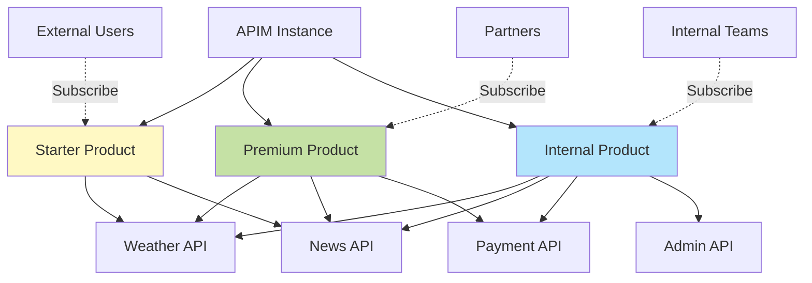
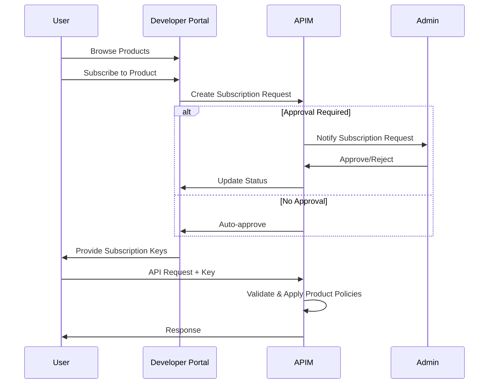

# What are Products in Azure APIM?

Products are how you package and distribute APIs to developers in Azure API Management.

## Overview

A **Product** is a collection of one or more APIs bundled together with:
- Access policies
- Usage quotas
- Terms of use
- Subscription requirements

## Why Use Products?

Products allow you to:
- **Package APIs** - Group related APIs together
- **Control Access** - Different access levels (Free, Basic, Premium)
- **Apply Policies** - Consistent policies across APIs
- **Manage Subscriptions** - Control who can access what
- **Enforce Quotas** - Different rate limits per product
- **Monetize APIs** - Charge for different tiers

## Product Hierarchy



## Product Example

### Starter Product
- **Included APIs**: Weather, News
- **Rate Limit**: 10 calls/minute
- **Quota**: 1,000 calls/day
- **Price**: Free
- **Approval**: Not required
- **Target**: Trial users, developers

### Premium Product
- **Included APIs**: Weather, News, Payment
- **Rate Limit**: 100 calls/minute
- **Quota**: 100,000 calls/day
- **Price**: $99/month
- **Approval**: Required
- **Target**: Paying customers

### Internal Product
- **Included APIs**: All APIs
- **Rate Limit**: Unlimited
- **Quota**: Unlimited
- **Price**: N/A
- **Approval**: Required
- **Target**: Internal teams

## Product Properties

### Core Settings

| Property | Description | Example |
|----------|-------------|---------|
| **Name** | Internal identifier | `starter` |
| **Display Name** | User-facing name | `Starter Plan` |
| **Description** | Product details | `Free tier for testing` |
| **State** | Published or not | `published` |
| **Subscription Required** | Needs subscription key | `true` |
| **Approval Required** | Manual approval needed | `false` |

### Advanced Settings

| Property | Description |
|----------|-------------|
| **Subscriptions Limit** | Max subscriptions per user |
| **Terms of Use** | Legal terms users must accept |
| **APIs** | Associated APIs |
| **Groups** | User groups with access |

## Creating Products

### Via Azure Portal

1. Navigate to APIM instance
2. Go to **Products**
3. Click **+ Add**
4. Configure:
   - Display name
   - Description
   - State (Published/Not Published)
   - Requires subscription
   - Requires approval
5. Click **Create**
6. Add APIs to product
7. Configure policies

### Via Bicep

```bicep
resource starterProduct 'Microsoft.ApiManagement/service/products@2023-05-01-preview' = {
  parent: apimService
  name: 'starter'
  properties: {
    displayName: 'Starter'
    description: 'Free tier for developers to test our APIs'
    terms: 'By using this API, you agree to our terms of service.'
    subscriptionRequired: true
    approvalRequired: false
    state: 'published'
    subscriptionsLimit: 100
  }
}

// Associate APIs with product
resource productApi1 'Microsoft.ApiManagement/service/products/apis@2023-05-01-preview' = {
  parent: starterProduct
  name: 'weather-api'
}

resource productApi2 'Microsoft.ApiManagement/service/products/apis@2023-05-01-preview' = {
  parent: starterProduct
  name: 'news-api'
}
```

### Via Azure CLI

```bash
# Create product
az apim product create \
  --resource-group rg-apim-learning \
  --service-name your-apim-name \
  --product-id starter \
  --display-name "Starter" \
  --description "Free tier for testing" \
  --subscription-required true \
  --approval-required false \
  --state published

# Add API to product
az apim product api add \
  --resource-group rg-apim-learning \
  --service-name your-apim-name \
  --product-id starter \
  --api-id weather-api
```

## Product Policies

Products can have their own policies that apply to all APIs:

```xml
<policies>
    <inbound>
        <base />
        <!-- Rate limit for this product -->
        <rate-limit calls="10" renewal-period="60" />
        <quota calls="1000" renewal-period="86400" />

        <!-- Add product identifier -->
        <set-header name="X-Product-Name" exists-action="override">
            <value>@(context.Product.Name)</value>
        </set-header>
    </inbound>
    <backend>
        <base />
    </backend>
    <outbound>
        <base />
    </outbound>
    <on-error>
        <base />
    </on-error>
</policies>
```

## Product Tiers Example

### Free Tier
```bicep
resource freeProduct 'Microsoft.ApiManagement/service/products@2023-05-01-preview' = {
  name: 'free'
  properties: {
    displayName: 'Free'
    description: 'Free tier - limited access'
    subscriptionRequired: true
    approvalRequired: false
    state: 'published'
  }
}
```

**Policy:**
```xml
<policies>
    <inbound>
        <rate-limit calls="5" renewal-period="60" />
        <quota calls="100" renewal-period="86400" />
    </inbound>
</policies>
```

### Basic Tier
```bicep
resource basicProduct 'Microsoft.ApiManagement/service/products@2023-05-01-preview' = {
  name: 'basic'
  properties: {
    displayName: 'Basic - $9/month'
    description: 'Basic tier with moderate limits'
    subscriptionRequired: true
    approvalRequired: false
    state: 'published'
  }
}
```

**Policy:**
```xml
<policies>
    <inbound>
        <rate-limit calls="50" renewal-period="60" />
        <quota calls="10000" renewal-period="86400" />
    </inbound>
</policies>
```

### Premium Tier
```bicep
resource premiumProduct 'Microsoft.ApiManagement/service/products@2023-05-01-preview' = {
  name: 'premium'
  properties: {
    displayName: 'Premium - $99/month'
    description: 'Premium tier with high limits'
    subscriptionRequired: true
    approvalRequired: true
    state: 'published'
  }
}
```

**Policy:**
```xml
<policies>
    <inbound>
        <rate-limit calls="500" renewal-period="60" />
        <quota calls="1000000" renewal-period="86400" />
    </inbound>
</policies>
```

## Product Lifecycle

### 1. Create Product
Define product properties and policies

### 2. Add APIs
Associate APIs with the product

### 3. Publish
Change state to "published"

### 4. Users Subscribe
Users request subscriptions via Developer Portal

### 5. Approval (if required)
Admins approve/reject subscription requests

### 6. Active Subscription
Users receive subscription keys

### 7. Monitor Usage
Track API usage and quotas

### 8. Update/Deprecate
Modify product or deprecate when needed

## Subscription Workflow



## Managing Products

### Publish a Product

```bash
az apim product update \
  --resource-group rg-apim-learning \
  --service-name your-apim-name \
  --product-id starter \
  --state published
```

### Add API to Product

```bash
az apim product api add \
  --resource-group rg-apim-learning \
  --service-name your-apim-name \
  --product-id premium \
  --api-id payment-api
```

### Remove API from Product

```bash
az apim product api delete \
  --resource-group rg-apim-learning \
  --service-name your-apim-name \
  --product-id starter \
  --api-id payment-api
```

## Built-in Products

APIM includes two built-in products:

### Starter (Deprecated)
- Legacy product
- Limited features
- Not recommended for new deployments

### Unlimited
- No rate limits or quotas
- Useful for internal testing
- Not visible in Developer Portal by default

## Best Practices

### 1. Clear Naming
Use descriptive names that indicate tier and purpose:
- ✅ `Premium - $99/month`
- ✅ `Enterprise API Access`
- ❌ `Product1`

### 2. Define Clear Tiers
Create distinct products for different use cases:
- Free/Trial tier
- Basic paid tier
- Premium tier
- Enterprise tier
- Internal tier

### 3. Set Appropriate Limits
Match limits to tier value:
```
Free:     10 calls/min,  1k calls/day
Basic:    50 calls/min,  10k calls/day
Premium:  500 calls/min, 1M calls/day
```

### 4. Use Approval Wisely
- Free tier: No approval
- Paid tiers: Require approval
- Internal: Require approval

### 5. Document Terms
Include clear terms of use:
- Acceptable use policy
- Rate limits
- Pricing
- Support level

### 6. Monitor Usage
Track product usage:
- Subscription count
- API calls per product
- Quota usage
- Popular products

## Product vs API Policies

Policies are inherited and combined:

```
Global Policy
    ↓
Product Policy
    ↓
API Policy
    ↓
Operation Policy
```

Example:
- **Global**: Add request ID
- **Product**: Rate limit 100/min
- **API**: Validate JWT
- **Operation**: Transform response

All policies apply in order.

## Next Steps

- [Creating Products Guide](creating-products.md)
- [Subscription Keys](../authentication/subscription-keys.md)
- [API Keys Explained](../authentication/api-keys.md)
- [Policy Examples](../../policies/examples/README.md)

## Resources

- [Products in APIM](https://learn.microsoft.com/azure/api-management/api-management-howto-add-products)
- [Subscriptions](https://learn.microsoft.com/azure/api-management/api-management-subscriptions)
